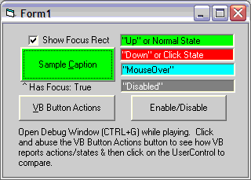



## LaVolpe Custom Button Template \[20 Feb 09\]

### Description

Updated. Want a custom button usercontrol shell? I am re-thinking a custom button &amp; this time thought I'd write a shell that I can reuse over &amp; over again. The attached contains a primitive example of using the shell and also contains the shell in another subfolder you can copy to your VB template's folder so it shows up when you select to "Add a Custom Control" to your project. Just thought I'd share it. I will post fixes for any bugs, but will not customize it to a point where it is no longer generic. See top of usercontrol for change history. Recent changes 20 Feb 09: Added Value property, support for Default button property, changed order of rendering/events in UpdateState routine, minor tweaks of some other stuff.
 
### More Info
 

             |
---                |---
**Submitted On**   |2009-02-21 14:38:18
**By**             |[LaVolpe](https://github.com/Planet-Source-Code/PSCIndex/blob/master/ByAuthor/lavolpe.md)
**Level**          |Intermediate
**User Rating**    |4.9 (54 globes from 11 users)
**Compatibility**  |VB 6\.0
**Category**       |[Custom Controls/ Forms/  Menus](https://github.com/Planet-Source-Code/PSCIndex/blob/master/ByCategory/custom-controls-forms-menus__1-4.md)
**World**          |[Visual Basic](https://github.com/Planet-Source-Code/PSCIndex/blob/master/ByWorld/visual-basic.md)
**Archive File**   |[LaVolpe\_Cu2144722212009\.zip](https://github.com/Planet-Source-Code/lavolpe-lavolpe-custom-button-template-20-feb-09__1-67586/archive/master.zip)

